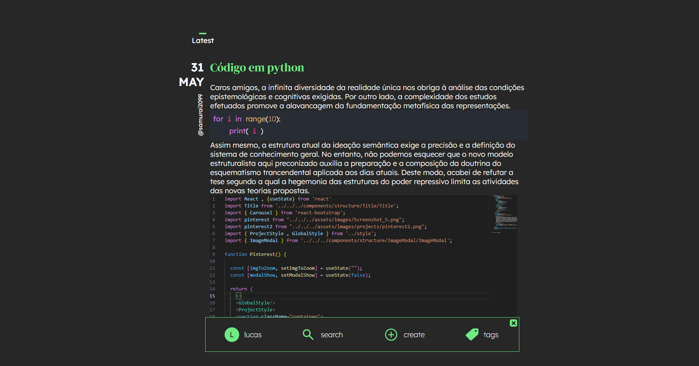

# myBlog
 - Personal app to make texts , add images and piece of codes. Using
 Django for backend and React for frontend.
 
 - 
 
# Backend instructions
* 1 - cd myBlog
* 2 - Create virtual environment - run: virtualenv myenv
* 3 - run : myenv\scripts\activate
* 4 - pip install -r requirements.txt
* 5 - cd backend\api
* 6 - run : python manage.py makemigrations
* 7 - run : python manage.py migrate
* 8 - run : python manage.py runserver

# Install and start react modules
* 1 - cd frontend
* 2 - npm install
* 3 - npm start

# Using the app
* 1 - subscribe an user
* 2 - login
* 3 - click "tags" and create some tags to classify the texts if you want
* 4 - click "create" and create your text
* 5 - use ##img## if you want to add an image , or use ##code## to add a code

